# Operationalizing ML with Azure

## Table of Contents 
Overview of the project
Architectural Diagram
Key Steps:
* Step1: Authentication
* Step2: Create and run Auto ML Experiment
* Step3: Deploy the best model
* Step4: Enable Application Insights
* Step5: Swagger Documentation 
* Step6: Consume Model Endpoints
* Step7: Create, Publish and Consume a pipeline
* Step8: Documentation
Future work

## Overview of the project

The objective of this project is to Create a Model, Select the best model, Deploy the model using Azure Container Instance (ACI) and consume the model endpoint via an HTTP API using Microsoft Azure. Along with this, need to create, publish and consume a pipeline. So, in a nutshell, need to perform end-to-end ML project on Azure. For this project, used the [Bank Marketing Dataset](https://archive.ics.uci.edu/ml/datasets/Bank+Marketing) to train the AutoML model. This dataset contains data about the direct marketing campaigns of a Portuguese banking institution and this dataset is from [UCL ML Repository](https://archive.ics.uci.edu/ml/datasets/Bank+Marketing). The goal of this project is to classify if the client will subscribe a term deposit (variable y). This project tasks are primarly divided into two major tasks:

1. Creating, Selecting and Deploying a model in Azure ML Studio
2. Create, Publish and consume a ML Pipeline

Architectural Diagram and Details steps with screenshots are provided below.

## Architectural Diagram

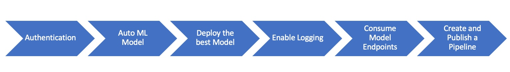

Above image depicts the steps involved in performing this End-to-End ML project. Lets get to each step and see what needs to be done in that step:

1. **Authentication:** In this step, need to install the Asure Machine Learning Extension which allows you to interact with Azure ML Studio and then create a Service Principle account and associate it with the workspace.
2. **Auto ML Model:** Here, need to create an experiment using Automated ML, Configure a compute cluster and use that cluster to run the experiment.
3. **Deploy the Best Model:** Once the the experiment run completes, select best model and deploy it using ACI. 
4. **Enable Logging:** In this step, will enable Application Insights and retrive logs. 
5. **Consume Model Endpoints:** Here, need to interact with endpoint to test it with sample data
6. **Create and Publish a Pipeline:** In this step, we automate these steps by a creating pipeline and publishing it.

## Key Steps:

### Step1: Authentication

Authentication plays an important role in automating the Machine Learning model. It helps in avoding the manual intervention thus flow is not interrupted. Due to restriction to role assignments permission in this lab, I have skiped this step  

### Step2: Create and run Auto ML Experiment

In this step, goal is to create and run Auto ML Experiment. For the purpose of this step, implemented following steps:

* Created a new Automated ML run
* Uploaded and created Bank marketing dataset in Azure ML (Here is the [link](https://archive.ics.uci.edu/ml/datasets/Bank+Marketing)  for the dataset), below is the screenshot
* Configured a new compute cluster by selecting Standard_DS12_v2 for Virtual Machine Size
* Created and ran the new Automated ML experiment using classification

**Registered Dataset screenshot**

**Experiment completed screenshot**: Below screenshot shows that the auto ml experiment is completed.

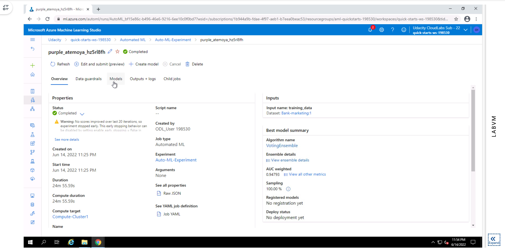

**Best model for the experiment screenshot**: Above and below picture provides the details of the best model after the experiment is completed. In this case best model is Voting Ensemble with 94.79% area under the curve. 

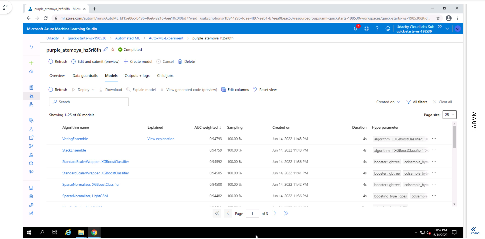

### Step3: Deploy the best model

In this step, the goal is to deploy the best model. Following steps are performed as part of this task:

* Select and Deploy the best model and enable "Authentication"
* Deploy the model using Azure Container Instance(ACI)

**Deploying the best model**

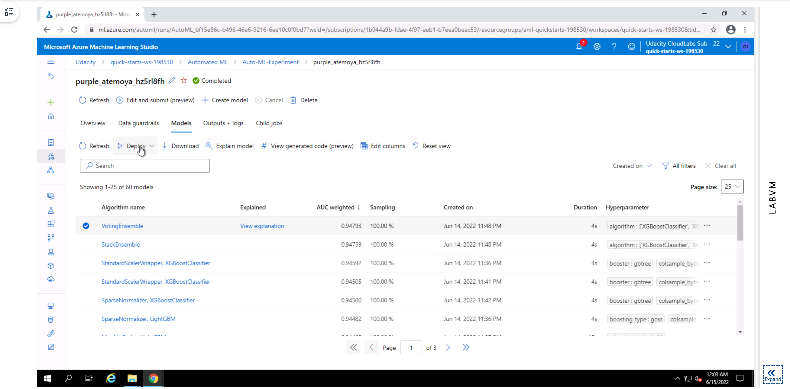

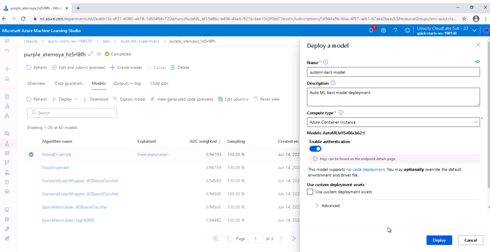

**Best model deployed successfully**

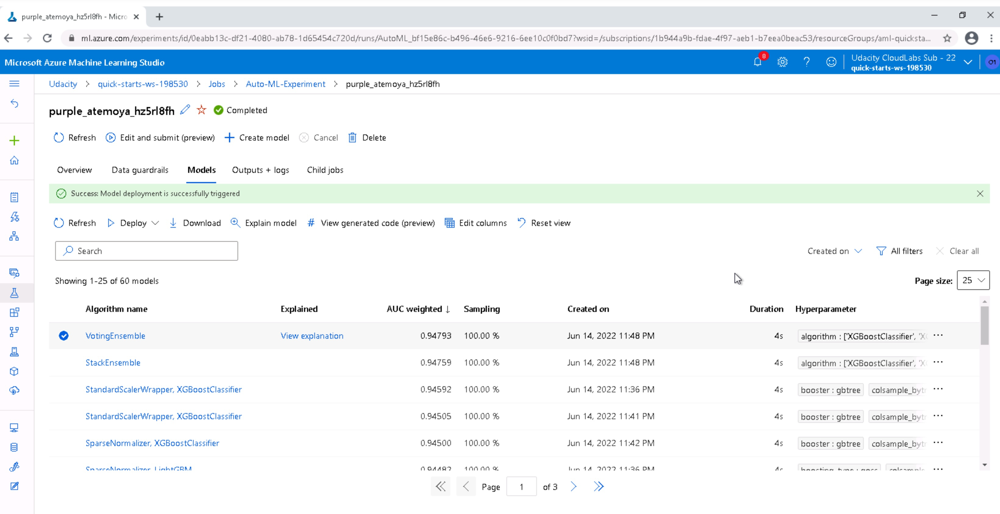

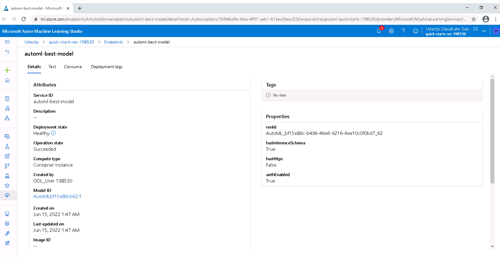

### Step4: Enable Application Insights

To enable application insights, I have downloaded the config.json (file for the current workspace) and stored along with the logs.py file. In the logs.py file, updated the name of the deployment and ran it to enable the application insights.

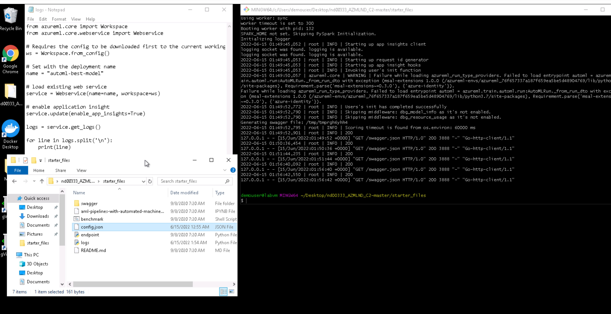

Note: Running the logs.py file requires the authentication. Once logged in, we can see the logs. In the below screenshot, we can notice that the application insights enabled = "true"

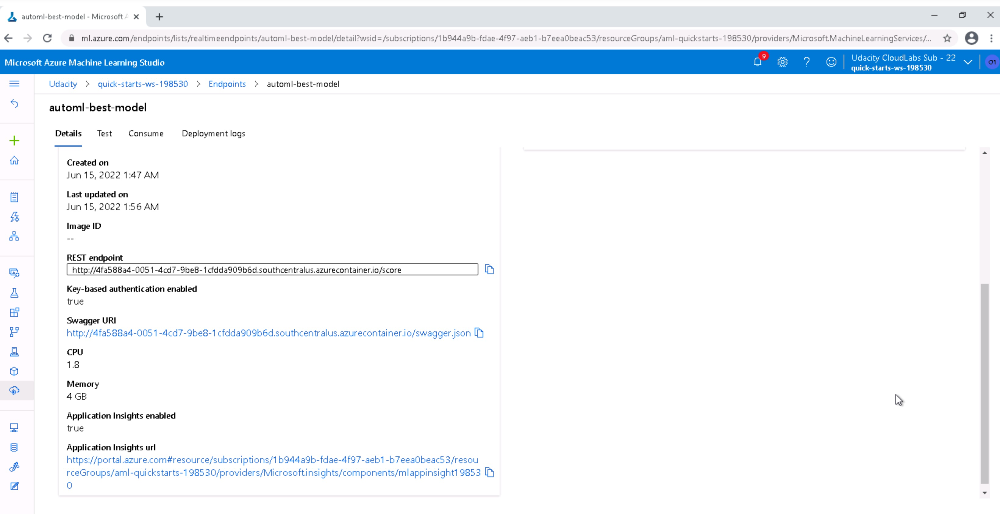

### Step5: Swagger Documentation 

In this step, we will consume the deployed model using swagger. For that, need to follow below steps

* Download the swagger.json file from the endpoint section (Swagger URI from the above screenshot)
* Run the swagger.sh and Serve.py files (). While swagger.sh will download the latest swagger container and will run it on the port 80 (Since I dont have permission for port 80, updated the script to 9000 port.), serve.py will start a python server.
* Open the brower and go to http://locanhost:9000 where serve.py list the contents of the directory. 
* update the top bar to explore http://localhost:9000/swagger.json. It will display the contents of the  API for the model.

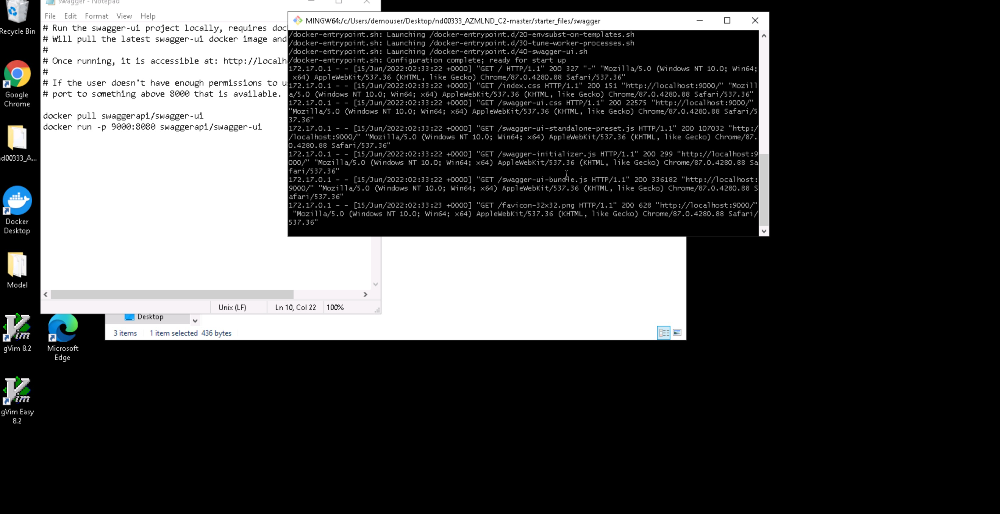

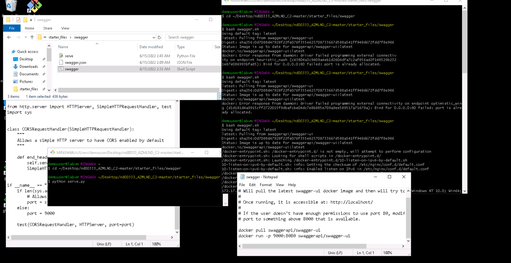

Screenshot of Swagger running on local host 

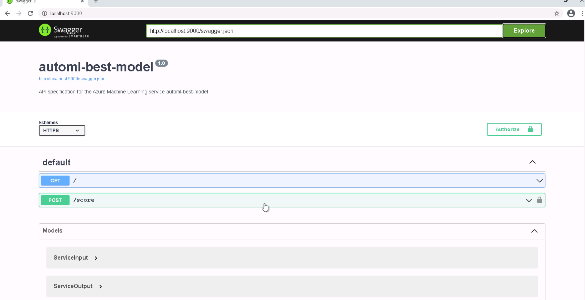

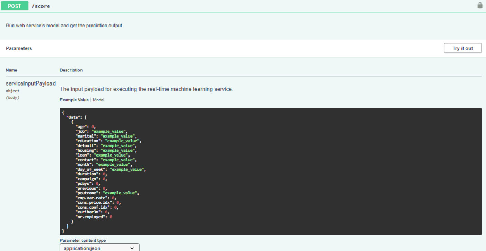

### Step6: Consume Model Endpoints

In this step, need to use scoring_uri and the key to match the key for your service and the uri that was generated after the deployment in the endpoint.py and execute it. Below is the screenshot of this step and as you can notice that the output after executing the endpoint.py is {'Result" : ["yes", "no"]}, which is expected.

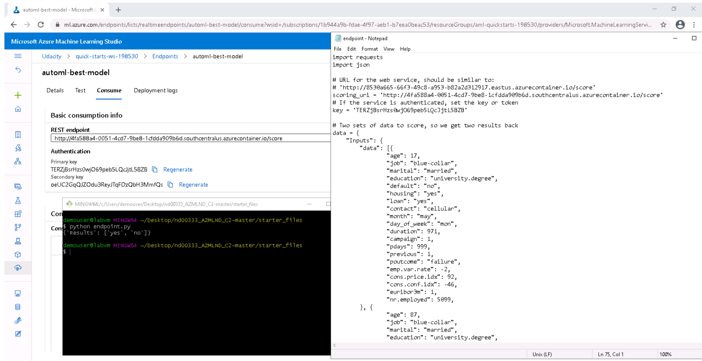

### Step7: Create, Publish and Consume a pipeline

In this step, I have used the jupyter notebook "amp-pipelines-with-automated-machine-learning-step.ipynb" and updated with environment details and ran it through. As result, a pipeline is created and below are the screenshots.

Created a pipeline

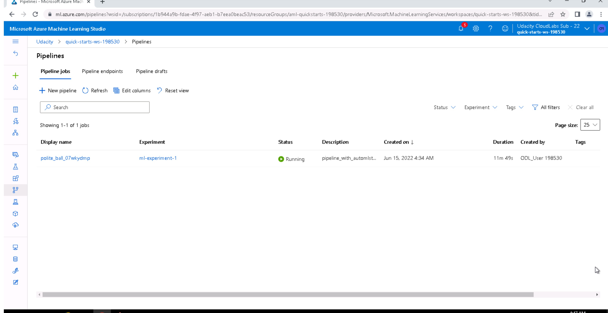

Pipeline Endpoint overview

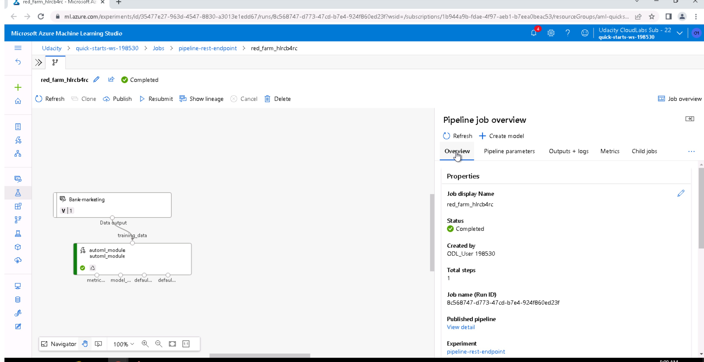

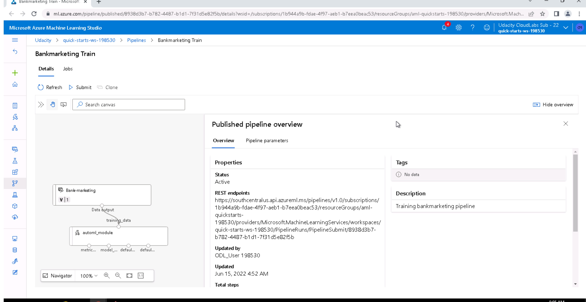

Completed pipeline runs and endpoints

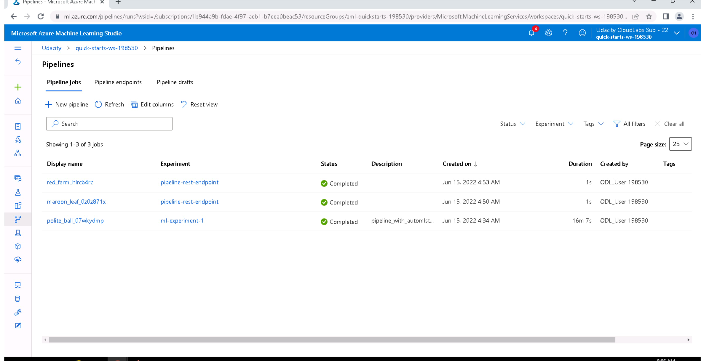

RunDetails widget screenshot 

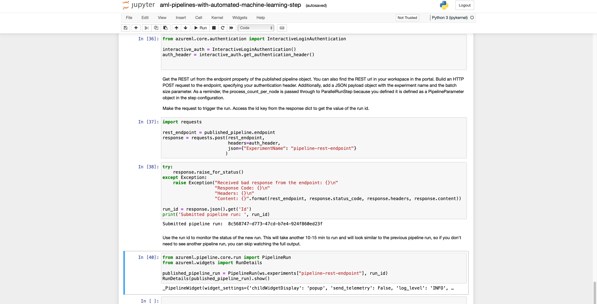

Note: Although run details widgets run successfully, it did not show the report. But, we can see the pipline status as completed and deployed.

### Step8: Documentation

Here is the link to [screencast](https://youtu.be/A1V90YCS6Rg) which provide little more description of the project steps.

## Future work

Current project is more focused on the operationalizing the model, in future, I would like to look at dataset more closely and perform some feature engineering steps. Also, I see there is a class imbalance in the current dataset, I would like to put my efforts in this particular area as well. In terms of models, I would like to try deep learning models just see how it performs against this data. 

